# kmdn user guide

kmdn is a desktop app for teams that keep their knowledge base as plain markdown in a git repository. People edit by hand or ask an agent. Every change goes through a review, and that review is an ordinary pull request. Afterwards any agent can read the knowledge base with a plain clone, no API needed.

This guide walks through the app screen by screen. The screenshots come from the macOS build at 1280×800 with a demo knowledge base called "Acme Handbook". I opened the demo as an existing local clone without signing in to GitHub or GitLab, so the screens that need a provider (the repository picker, submit for review, the review layout, discussions) are described in words and marked as such.

## Vocabulary

| Word | Meaning |
|---|---|
| Knowledge base (KB) | A git repository of markdown documents with a `.kmdn/config.yaml` and a generated `AGENTS.md` |
| Document | A markdown file. Folders are sections. Titles come from frontmatter |
| Thread | One change: a git worktree on its own branch, an optional agent conversation, and eventually a pull request |
| Review | An open pull request that touches markdown, shown in the review layout |
| Publish | Merging the pull request. The document lands on the default branch |

## Requirements and installation

kmdn is a Tauri 2 application. There are no prebuilt packages yet, so you build it from the repository.

- Node 22 or newer and pnpm 10.
- A stable Rust toolchain with `rustfmt` and `clippy`. The repository pins `stable` in `rust-toolchain.toml`.
- On macOS, the Xcode command line tools. On Linux, the WebKitGTK and GTK development packages listed in `.github/workflows/ci.yml`.
- Optionally an agent CLI on your `PATH`: Claude Code (`claude`), Codex (`codex`), or pi (`pi`). The app works without one; you just edit by hand.

Build and run:

```bash
pnpm install
pnpm tauri dev
```

```bash
pnpm tauri build
```

On macOS the release build lands in `target/release/bundle/macos/kmdn.app`. The command line companion `kmdn-cli` is built with `cargo build -p kmdn-cli` and described at the end of this guide.

## First run

The first screen is a three step wizard: sign in, choose a knowledge base, choose a folder. If you already have a clone on disk, skip all of it with **Open existing clone** in the top right corner.

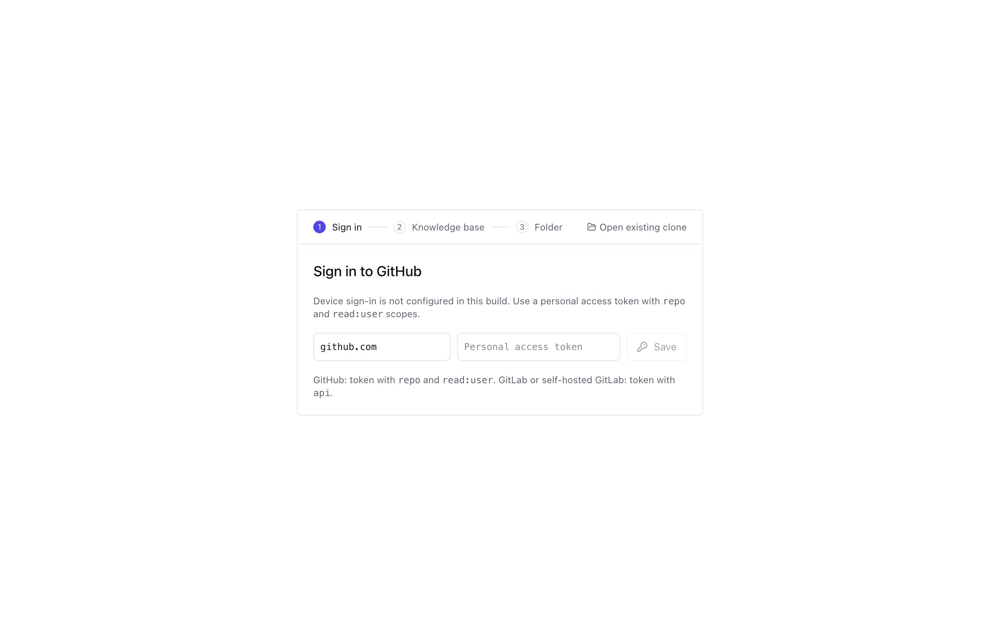

### 1. Sign in

For GitHub, paste a personal access token with the `repo` and `read:user` scopes. Builds that ship with a GitHub client id show a **Continue with GitHub** button instead. That one uses the device flow: you enter a code on github.com and the app waits for the approval.

For GitLab, including self-hosted, change the host field (`gitlab.com`, `gitlab.example.org`) and paste a token with the `api` scope.

kmdn checks the token against the provider before storing it. Tokens live in the app's data folder, never in the repository.

### 2. Choose a knowledge base

Once signed in you see the repositories you have access to. Filter the list, pick one, or paste a repository URL. **New knowledge base** creates a private repository under your account from the starter template: a `README.md`, a `getting-started.md`, the `.kmdn/config.yaml`, and a generated `AGENTS.md`. You give it a repository name and one line on what it covers.

### 3. Choose a folder

The default is `~/kmdn/<repository>`. **Browse** picks another location. This folder is your clone, and other tools can use it too. kmdn keeps it on the default branch and does its own work in separate worktrees next to it (see [Where things live on disk](#where-things-live-on-disk)).

**Clone and open**, or **Create**, finishes the wizard and opens Home.

### Open existing clone

Pick any folder that holds a git clone of a knowledge base. This is also how you use kmdn with a repository that has no remote yet. Without a remote there is nothing to sync and the review features stay off.

## Home

Home is a composer with your threads underneath.

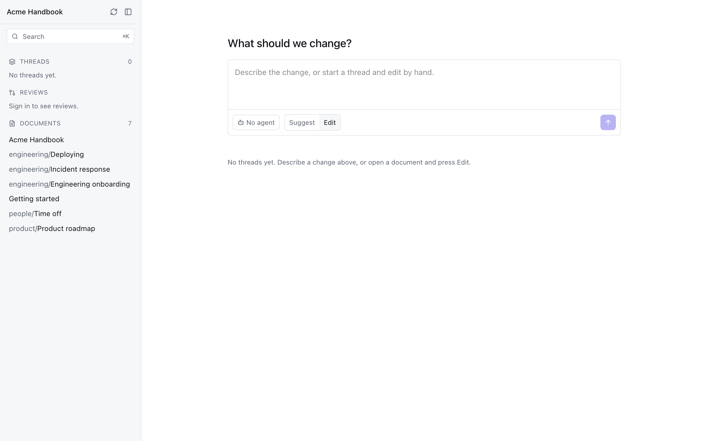

The text box takes a description of the change you want. The arrow starts a thread named after the first words and opens it. Nothing goes to an agent at this point; you do that inside the thread. The **Suggest** and **Edit** toggle picks the agent mode (see [Agents](#agents)); it seeds the new thread's agent panel, where you can still change it before the first message.

Below the composer, threads are grouped by status: **In review** when a pull request exists, **Draft** otherwise. Click one to open it.

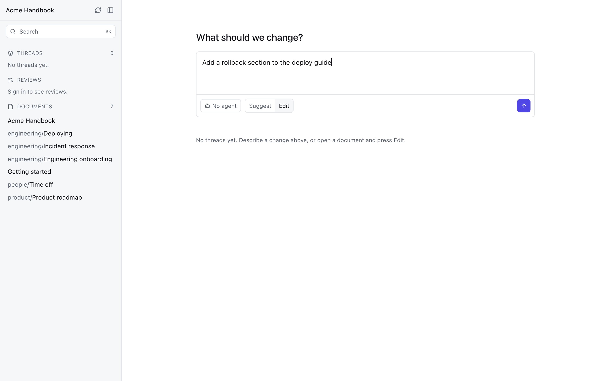

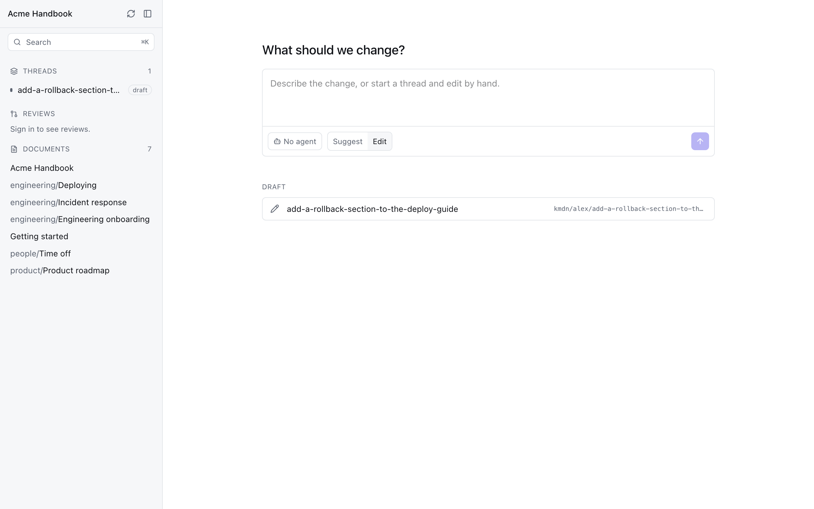

## Sidebar

The sidebar is open on Home, in the document view, and in the review layout. Inside a thread it collapses to an icon strip. The panel button, the palette action **Toggle sidebar**, or a click on any strip icon brings it back.

From top to bottom:

- The knowledge base name. Clicking it goes Home.
- **Sync now**, the circular arrow. It fetches, fast-forwards the default branch, and rebases every kmdn thread. Sync also runs by itself when the window gains focus, then every minute while it has focus, and every five minutes once the window has been in the background for ten.
- **Search**, which opens the command palette (⌘K).
- **Threads**, each with a status dot and a pill. A grey dot and a `draft` pill for drafts, an accent dot and `in review` once a pull request exists, an amber dot when the thread conflicts with the default branch. A dashed **Local changes** card shows up here when the main clone has uncommitted changes or sits on a foreign branch (see [Local changes](#local-changes)).
- **Reviews**: open pull requests that touch markdown, newest activity first, with number, title, and author. It reads "Sign in to see reviews" when there is no token for the repository's host.
- **Documents**: every document in the knowledge base, folder in grey, title from frontmatter. A document without a frontmatter title uses its first heading, then its file name.

## Documents

Clicking a document in the sidebar opens it in the reading view, rendered as it exists on the default branch.

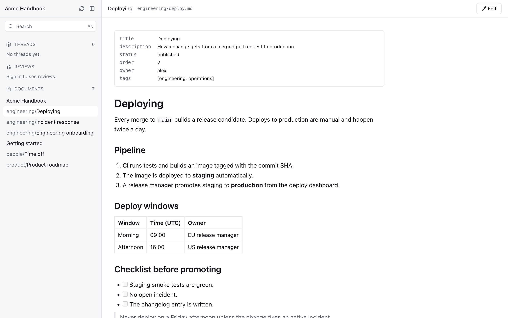

The header shows the title and the path. **Edit** starts a thread named after the document and opens the file in that thread's editor. Abandon such a thread without changing anything and nothing is left behind.

**Discuss** (signed-in only) opens a drawer with the discussion attached to this document. A discussion is a provider issue labeled `kmdn` and titled with the document path, one per document; the first comment creates it. It is the place for "this section is outdated", as opposed to a comment on a pending change.

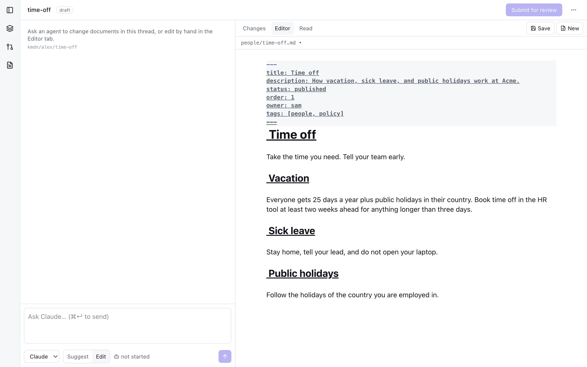

### Frontmatter

Documents are GitHub Flavored Markdown with optional YAML frontmatter. kmdn reads these keys:

| Key | Use |
|---|---|
| `title` | Shown in the sidebar, the palette, and `AGENTS.md`. Falls back to the first `#` heading, then the file name |
| `description` | One line summary, listed in `AGENTS.md` |
| `status` | `draft`, `review`, `published`, or `deprecated`. Deprecated documents stay for history and are marked in `AGENTS.md` |
| `order` | Sort order inside a folder |
| `owner`, `tags`, `reviewed` | Free metadata for people and agents |

Links are relative paths. Images live in an `assets/` folder next to the document. In the editor the frontmatter folds into a one line chip until you put the cursor on it.

## Command palette

Press ⌘K anywhere, or click **Search** in the sidebar.

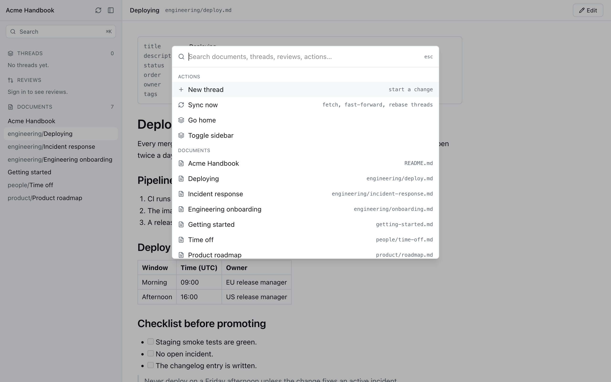

The palette lists actions first, then threads, reviews, and documents. Typing filters everything with fuzzy matching. Arrow keys and Enter, or a click, run the entry. Escape closes it.

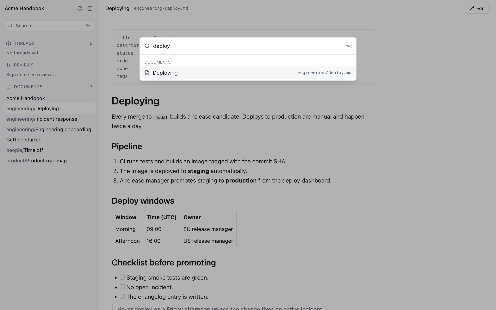

The actions are **New thread** (type `new <name>` to name it from the palette), **Sync now**, **Go home**, and **Toggle sidebar**.

## Threads

A thread is where a change happens. It has its own branch, `kmdn/<you>/<slug>`, and its own worktree, so several threads can be open at once without touching each other or the main clone.

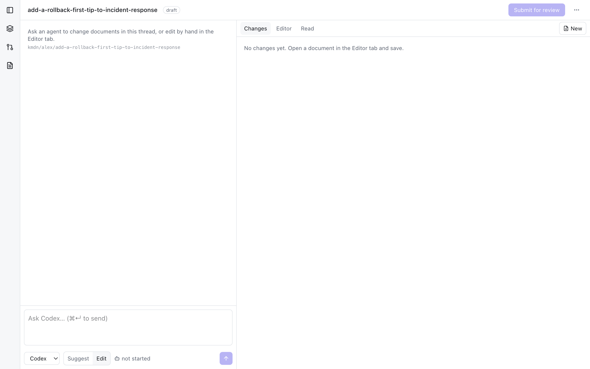

The header shows the thread name, a status pill, and one primary action:

| Status | Primary button |
|---|---|
| Draft with no changes | Submit for review, disabled |
| Draft with changes | **Submit for review** (needs a signed-in provider) |
| In review or changes requested | **View review** |

The **⋯** menu shows the branch name and **Abandon thread**. Abandoning asks for confirmation, then deletes the worktree and the `kmdn/` branch. A review that is already open on the provider stays there.

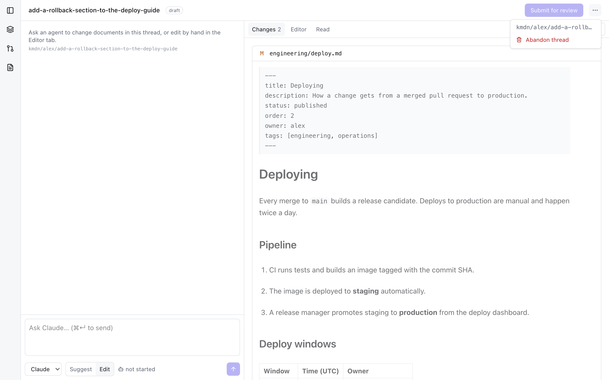

The left column is the agent timeline and composer (see [Agents](#agents)). The right column has three tabs.

### Editor

The **Editor** tab lists the documents in the thread's worktree until you open one.

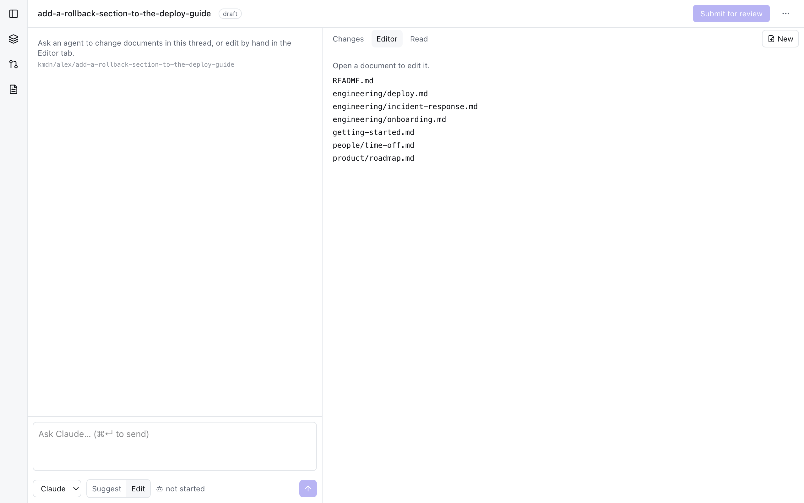

Opening a document shows the live-preview editor. Headings, emphasis, lists, task boxes, tables, quotes, links, and images render in place while you type, and the markdown syntax comes back on the line you are editing. The frontmatter folds into a summary chip.

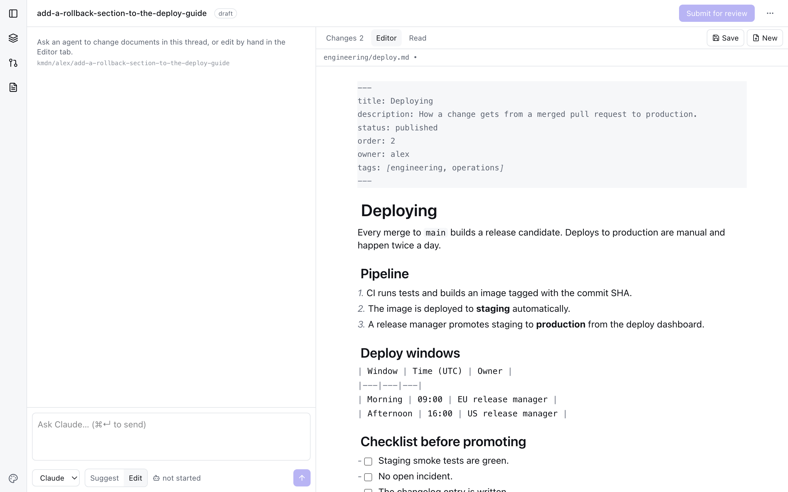

A dot after the file name marks unsaved changes. **Save**, or ⌘S, writes the file into the worktree and commits it to the thread's branch as `Update <document>`. The commit takes markdown documents and files under `assets/` only; anything else in the worktree is ignored.

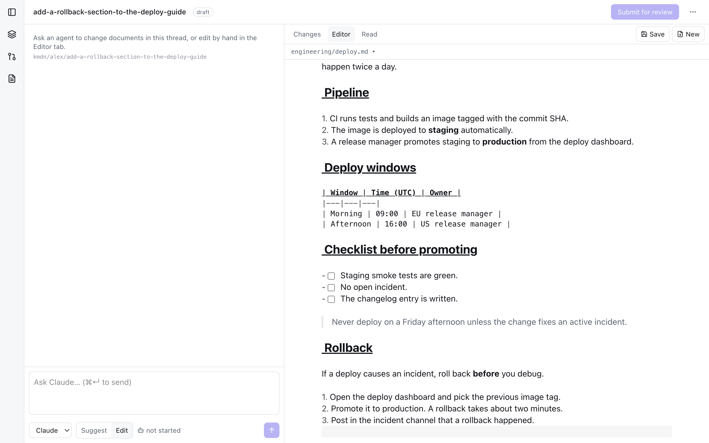

**New** asks for a relative path, adds `.md` if you left it out, and opens a fresh document with `title` and `status: draft` frontmatter. Save it like any other document.

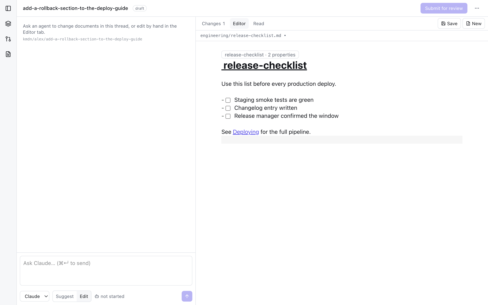

### Changes

The **Changes** tab is the thread's diff against the default branch, rendered block by block rather than line by line. Each file has a header with its status letter (A added, M modified, D deleted, R renamed); clicking the header opens the file in the editor. Unchanged blocks are faded, added and removed blocks carry a colored bar, and a modified block shows old and new text side by side. The tab badge counts changed files.


### Read

The **Read** tab renders the document that is open in the editor, unsaved edits included, at reading size.

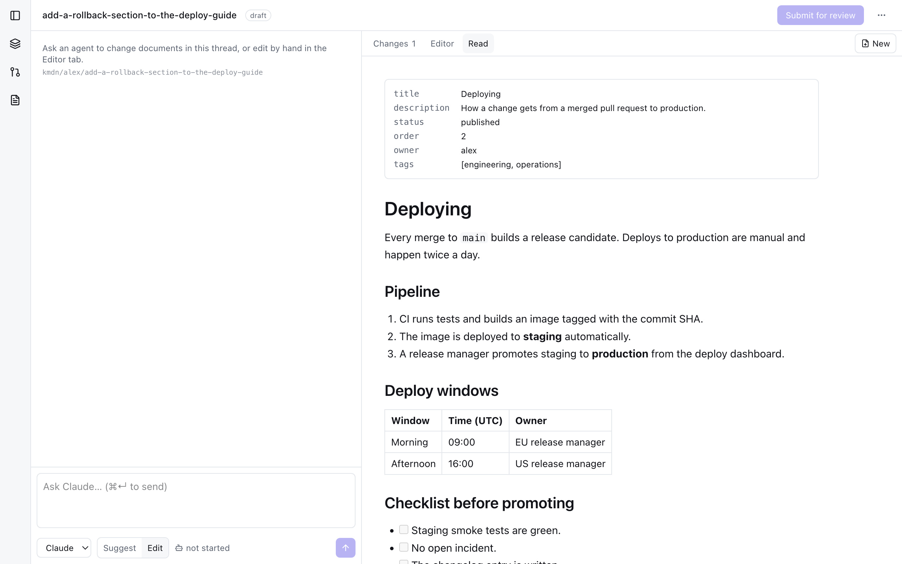

### Sidebar inside a thread

The sidebar collapses to an icon strip when a thread opens. The first icon expands it, so the thread list sits next to the thread.

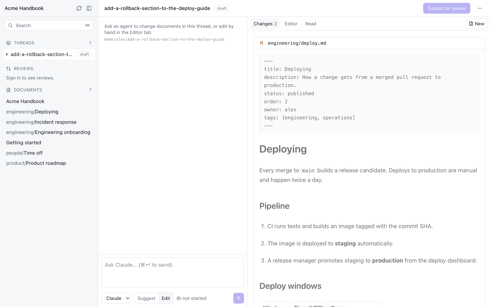

## Agents

Every thread can run one agent session. The picker at the bottom of the timeline lists Claude Code, Codex, and pi; the ones missing from your `PATH` are greyed out. Pick the mode next to it. Once the first message is sent, the agent and the mode are fixed for that thread.

| Mode | What the agent may do |
|---|---|
| Suggest | Read the knowledge base and propose changes in its reply. Writes are refused |
| Edit (default) | Read, and write markdown documents and files under `assets/`. Shell commands are refused |
| Developer | Edit plus shell commands, each one approved by you. Not in the picker yet |

The first message the agent receives describes the knowledge base: the format, where images go, that `AGENTS.md` is the map of documents and must not be edited, and the rules of the mode. Type your request and press the arrow or ⌘↵.

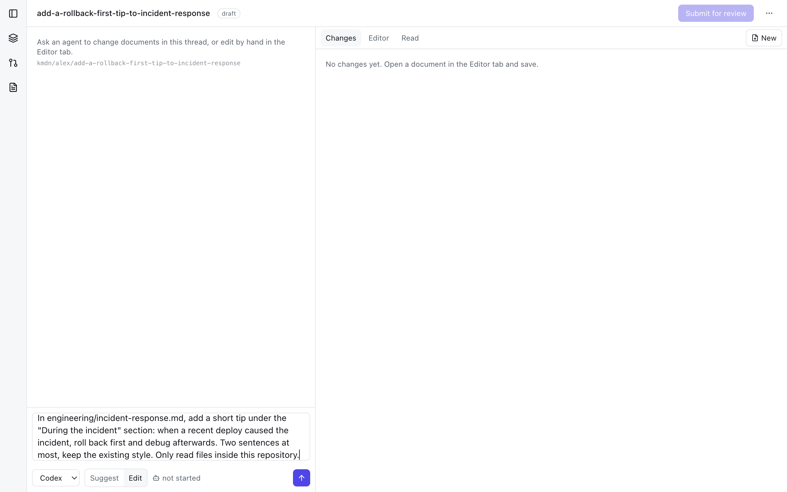

While the agent works, the timeline fills in:

- Your messages, right-aligned in grey.
- The agent's replies, streamed as they arrive.
- Tool calls, one line each. A spinner while running, a check when done, a cross when refused or failed. Reads show the file, writes show the path, shell calls show the command.
- Permission requests for anything kmdn does not decide by itself, with **Allow** and **Deny** buttons.
- **Stop**, next to the send button, cancels the current turn.

kmdn decides most tool calls without asking. Reads are allowed. Writes are allowed to markdown documents and to `assets/`, never to `AGENTS.md` or `.kmdn/`, and never in Suggest mode. Shell is refused outside Developer mode. Only what is left, such as a web fetch, reaches you as a question.

Codex is the special case, because it has no separate read tool: it looks at files with `cat`, `sed -n`, `rg`, `ls`, `find`, and `git log`. kmdn recognises those as reads when the command is a single program from a short list, has no pipes, redirections, or substitutions, and only touches paths inside the knowledge base. Anything else (`cat a.md | grep x`, `python3`, a path under your home directory) is still refused as shell. In the screenshot Codex reads the document, patches it, and the Changes tab picks up the edit as soon as the turn ends.

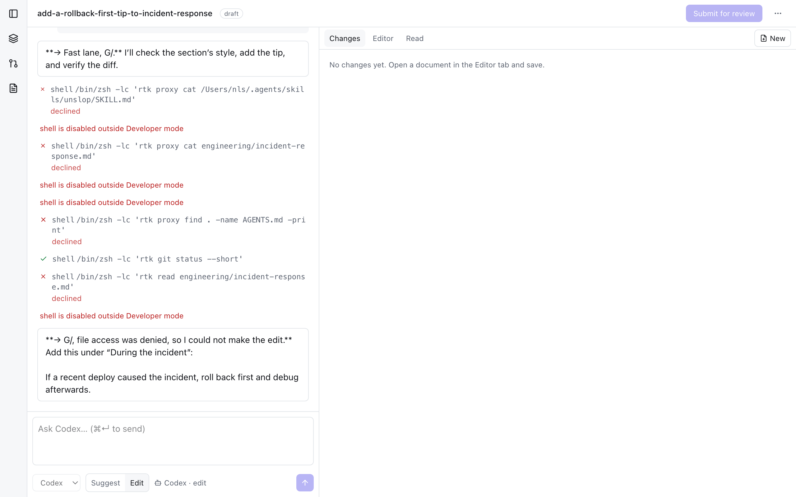


kmdn sends an OS notification when an agent needs your approval or finishes while the window is not focused, and when a new review appears that you did not author. When an agent cannot reach its model, for example because a login expired, the provider's error shows up in the timeline instead of silence.

## Sync, local changes, and conflicts

### Sync

Sync fetches from `origin`, fast-forwards the default branch in the main clone, and rebases every `kmdn/` thread onto it. It runs when the window gains focus, every minute while focused, and whenever you click **Sync now** or run it from the palette. A thread with unsaved edits is skipped until you save. Adopted branches (below) are never rebased automatically.

### Local changes

kmdn never commits in the main clone, but other tools might leave work there. When the clone has uncommitted changes, a dashed **Local changes** card appears at the top of the Threads section. It is read-only in kmdn.

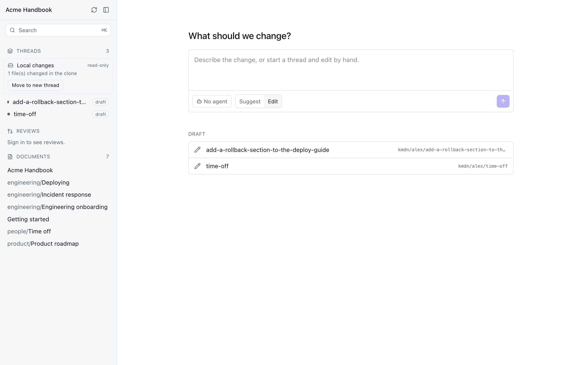

**Move to new thread** stashes the changes, new files included, creates a thread named `local-changes` from the default branch, and applies the stash into its worktree. The main clone ends up clean and the changes appear in the thread's Changes tab, ready to save and submit.

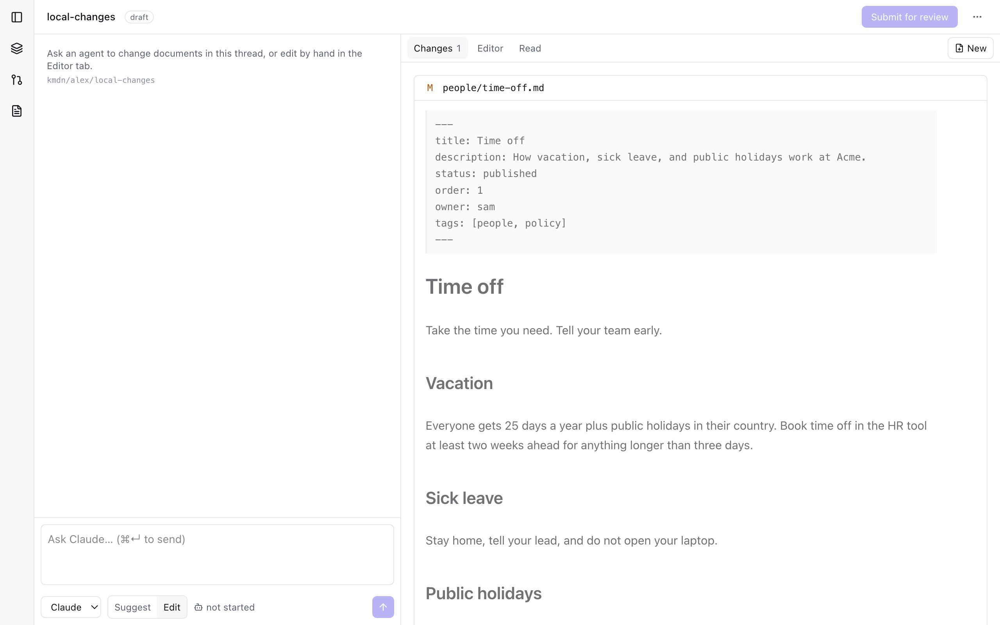

If someone checked out another branch in the main clone, the card reads "on `<branch>`" and offers **Adopt branch as thread**. That puts the clone back on the default branch and registers the branch as a thread under its own name. The thread behaves like any other, with two exceptions that protect the branch: sync does not rebase it, and abandoning the thread removes the worktree but keeps the branch. The card also reports a git operation in progress, a merge or a rebase, and offers no action until it is finished.

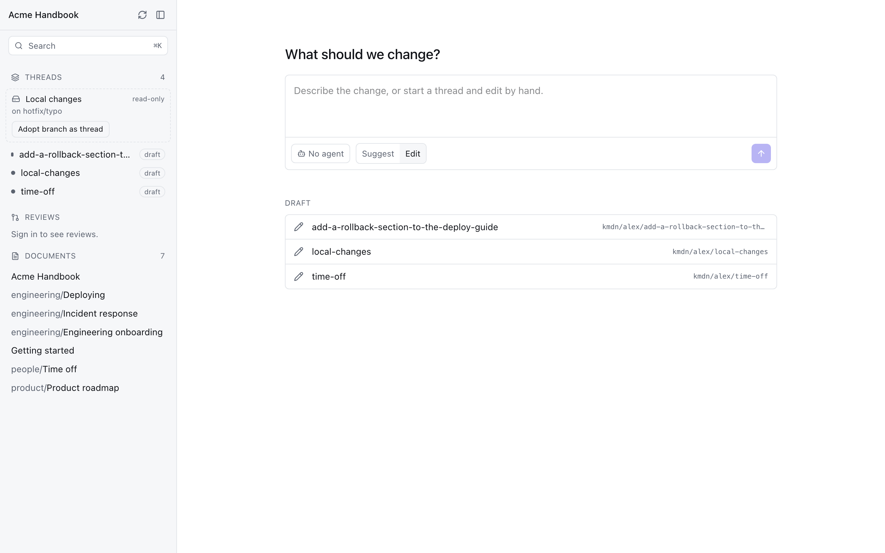

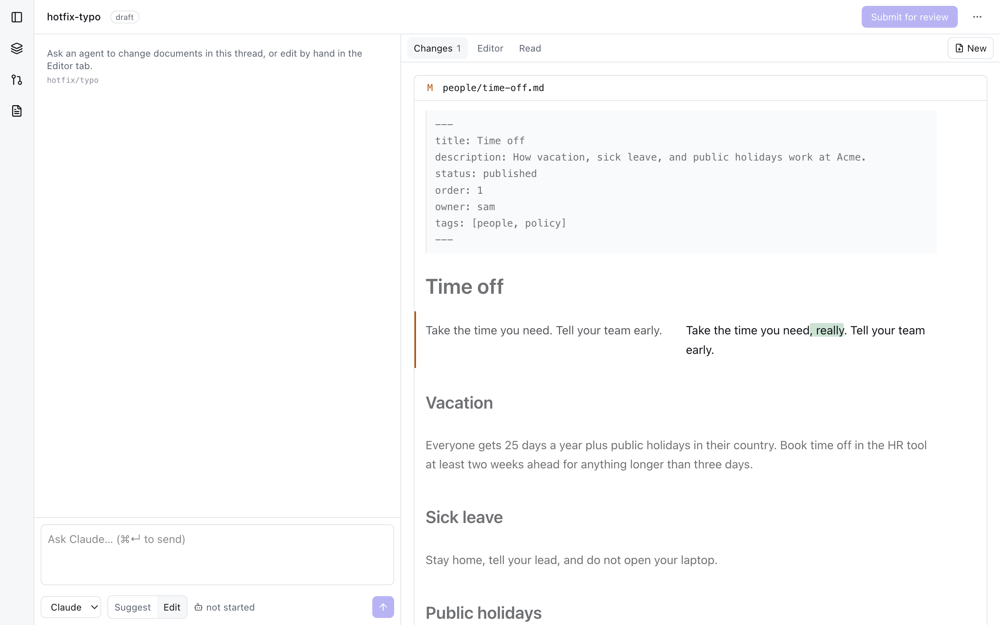

### Conflicts

When a thread's edits overlap with something that landed on the default branch, sync stops rebasing that thread and marks it: an amber dot in the sidebar, and a banner inside the thread.

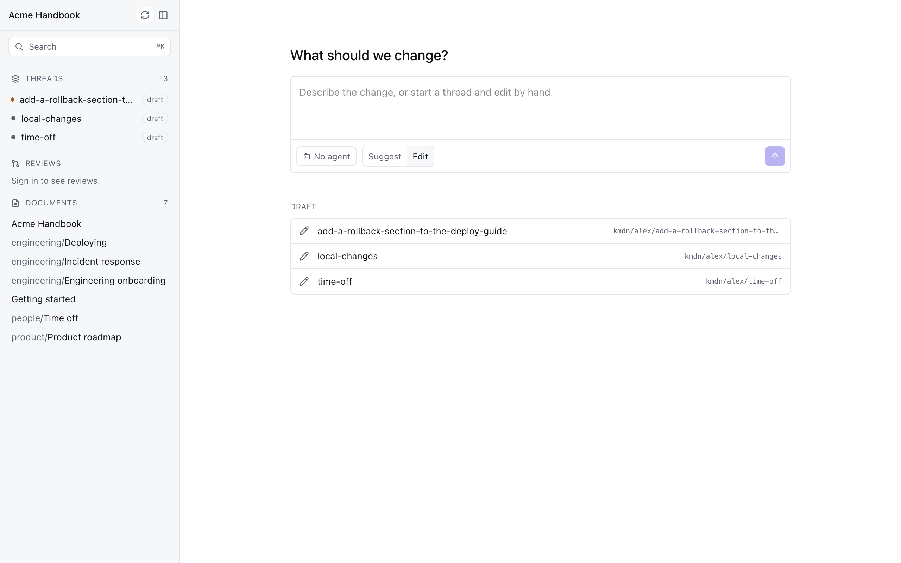

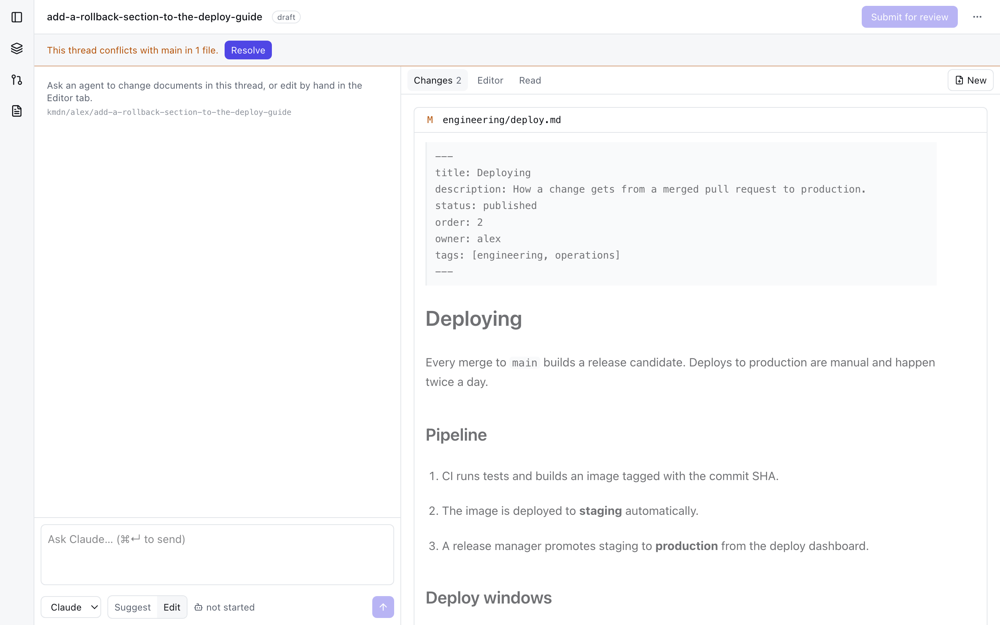

**Resolve** opens the block-level resolver. You never see conflict markers. For each file, unchanged blocks are listed faded, and every block that differs shows **On main** next to **This thread** with three choices: **Keep main**, **Keep mine**, **Keep both**.

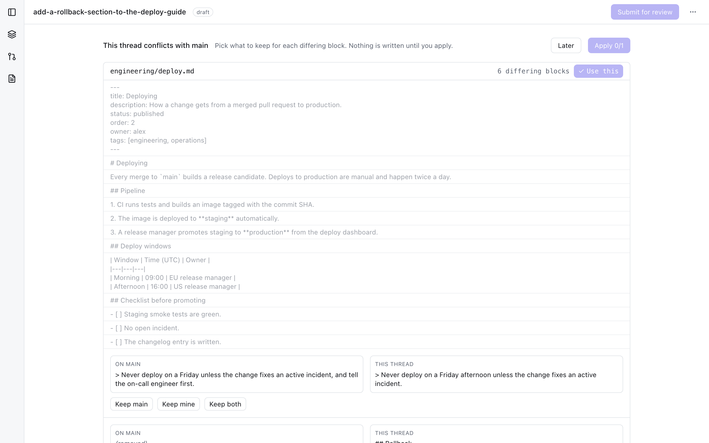

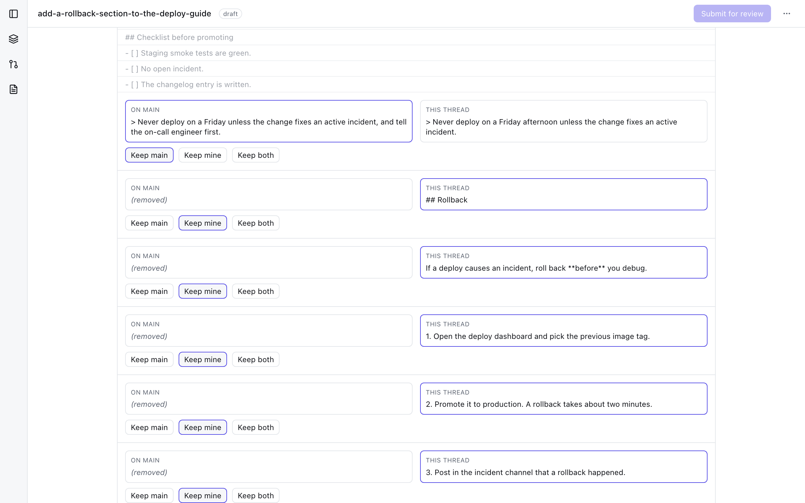

**Use this** freezes the file with your choices. When every file is settled, **Apply** rebases the thread onto the default branch with those files as the resolution. Nothing is written until you apply. **Later** leaves the thread as it was.

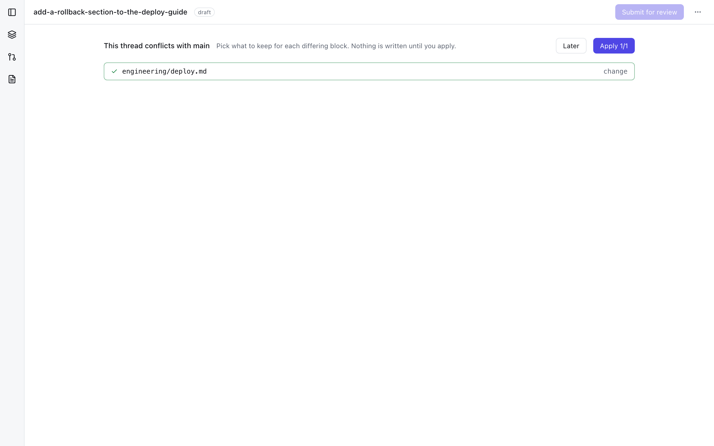

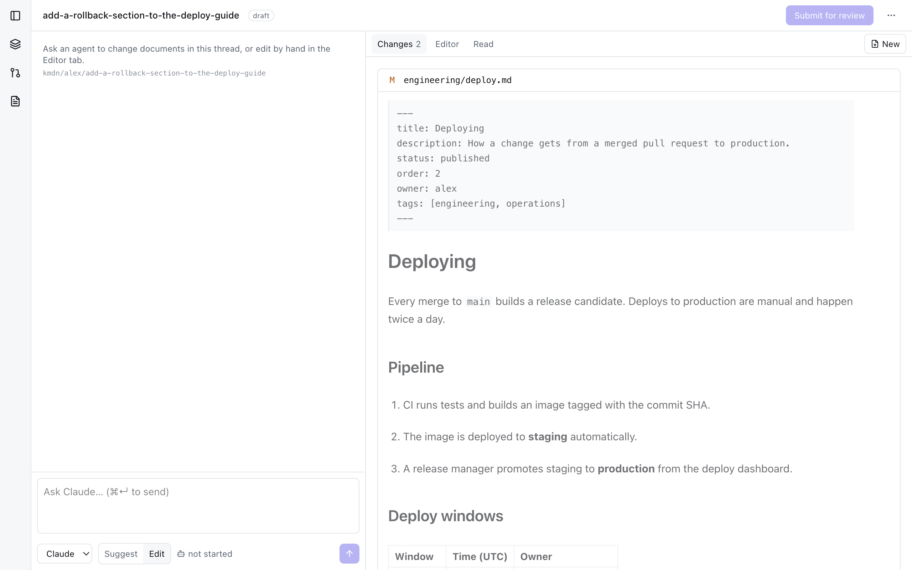

## Submit for review

This needs a signed-in provider for the repository's host, so there is no screenshot. In a thread with changes, **Submit for review** opens a small form above the tabs with a title (leave it empty for one generated from the changed documents) and an optional summary for reviewers.

**Open review** runs the checks (broken relative links, invalid frontmatter, oversize assets, a stale `AGENTS.md`), regenerates `AGENTS.md`, pushes the branch, and opens a pull request labeled `kmdn`. With `post_agent_log: true` in the knowledge base config, a condensed log of the agent conversation (your prompts, one line per agent turn, the files it touched) goes in as a comment. If a check fails, the form lists the findings and nothing is pushed.

After a successful submit a banner shows the pull request URL, the status pill switches to `in review`, and the primary button becomes **View review**.

## Reviews

Also provider-dependent, so described in words. The **Reviews** section of the sidebar lists open pull requests that touch markdown or assets. Opening one shows the review layout:

- The header has the number and title, a status pill (`draft`, `in review`, or `published` once merged), the author, and a summary of approvals, requested changes, failing checks, and merge conflicts. **Open on provider** opens the pull request in your browser.
- The pull request description comes first, then each changed file as a rendered, block-aligned diff. Hovering a block reveals a comment anchor; clicking it addresses your next comment to that block.
- The conversation drawer on the right (toggle with the panel button) holds the comments in order, a text box, and **Comment**.
- **Request changes**, **Approve**, and **Publish**. Publish is a squash merge, enabled only when the provider reports the pull request as mergeable with no changes requested and no failing checks. kmdn adds no rules of its own; branch protection and required reviews live on the provider. After publishing, kmdn fetches and fast-forwards the default branch so the document is current right away.

## Appearance

kmdn follows the operating system's light or dark setting.

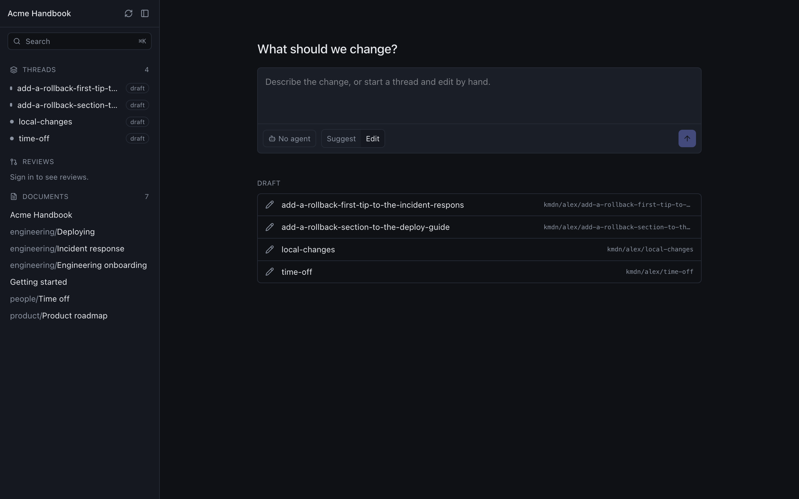

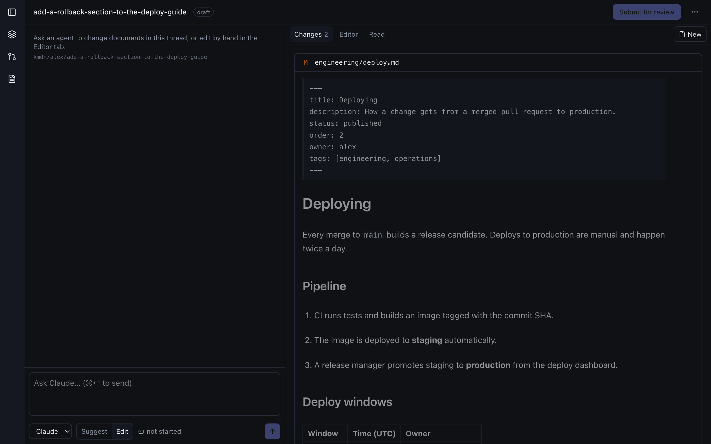

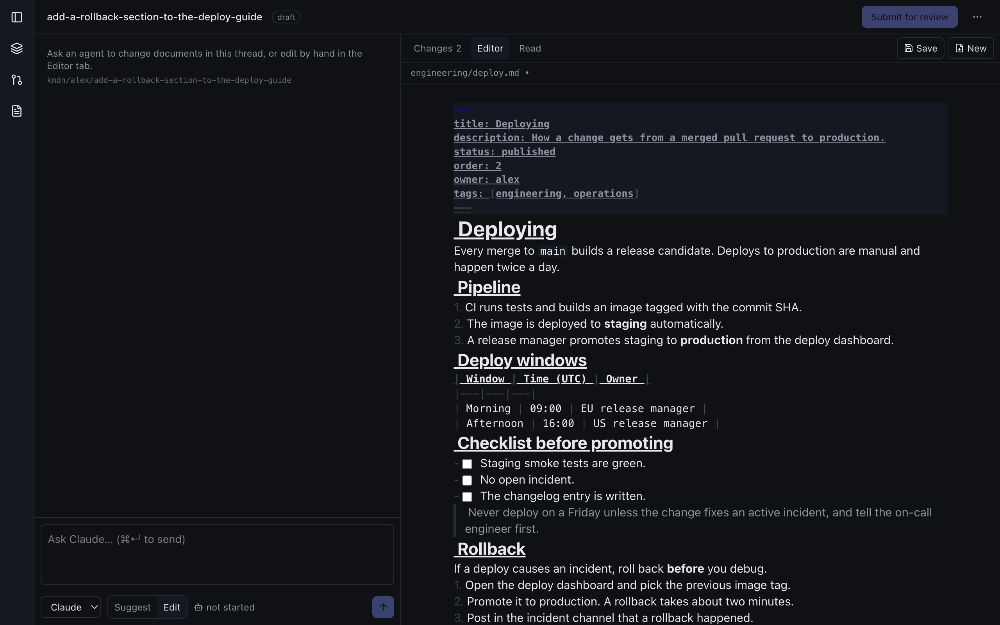

## Keyboard shortcuts

| Shortcut | Where | Action |
|---|---|---|
| ⌘K | Everywhere | Open or close the command palette |
| ↑ ↓ Enter | Palette | Move and run |
| Esc | Palette | Close |
| ⌘S | Editor | Save and commit the open document |
| ⌘↵ | Agent composer | Send the message |

## Where things live on disk

| Path | Contents |
|---|---|
| `<clone>/` | Your clone of the knowledge base, always on the default branch |
| `<clone>.kmdn-worktrees/<slug>/` | One worktree per thread, next to the clone |
| `kmdn/<user>/<slug>` | The branch of a thread |
| `<clone>/.kmdn/config.yaml` | Name, description, branch prefix, review labels, `post_agent_log`, asset size cap, paths agents may write |
| `<clone>/AGENTS.md` | Generated map of the documents for agents. Regenerated on submit and by `kmdn-cli index`; do not edit by hand |
| App data folder (`~/Library/Application Support/dev.kmdn.desktop/` on macOS) | Stored tokens, the email used for commits, and one transcript per agent session under `agent-sessions/<slug>/` |

Abandoning a thread removes its worktree and, for `kmdn/` branches, the branch. A thread whose pull request was merged shows as `published` in the review layout; abandon it to remove its worktree. A worktree directory deleted by hand is ignored until git prunes it.

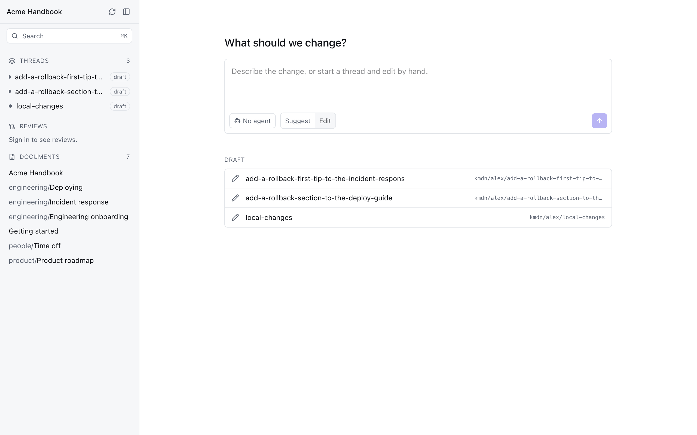

## Command line and CI

`kmdn-cli` runs the same checks and index generation as the app, for CI and scripts:

```bash
kmdn-cli check --path /path/to/kb
```

```bash
kmdn-cli index --path /path/to/kb
```

```bash
kmdn-cli init --name "Team handbook" --path /path/to/empty/folder
```

`check` exits with status 1 when it finds errors and accepts `--asset-cap <bytes>`; `--json` switches any command to machine-readable output. `init` writes the starter template into an existing folder. Ready-made workflows that run `check` on every pull request are in `templates/ci/` for GitHub Actions and GitLab CI.

## Known limitations

- Codex reads through shell commands, so a compound command (pipes, redirections, `&&`), an unlisted program, or a path outside the knowledge base is refused outside Developer mode. Codex usually rephrases and carries on.
- Reads by Claude Code and pi go through their own read tools and are not restricted to the knowledge base.

## Not in this version

- Renaming a thread, copying its branch, or opening its folder from the menu.
- Developer mode in the agent picker, model pickers, `@document` mentions, and image attachments in the composer.
- Review comments mirrored into the thread timeline, and agent assistance during review.
- A settings screen. Notification toggles are stored per device but have no UI yet.
- Windows and Linux packages. The build targets exist; only macOS was exercised for this guide.
